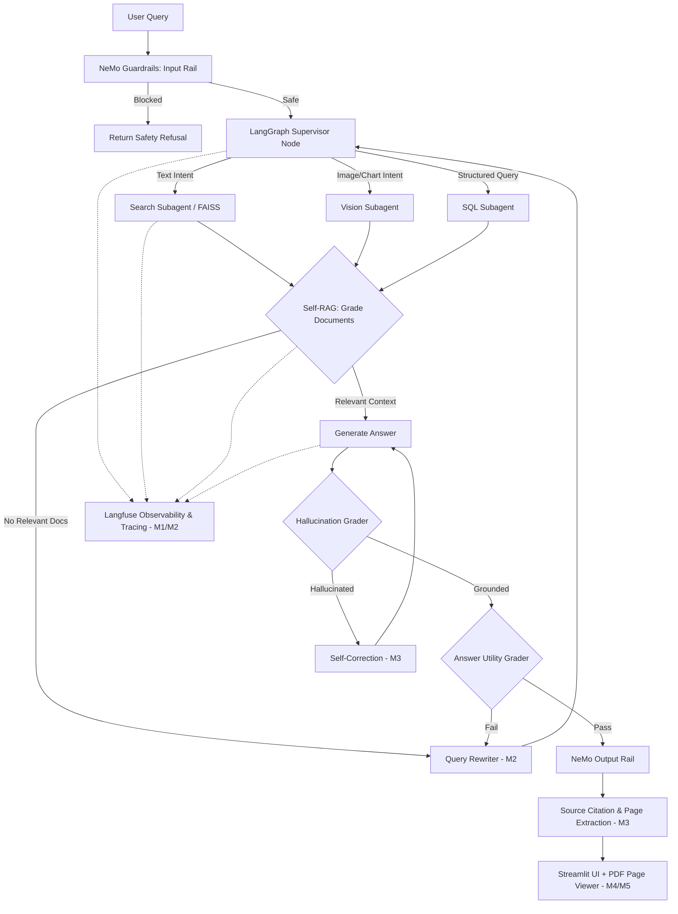

# OmniBrain — Agentic Multi-Modal RAG Orchestrator

> An intelligent, self-correcting multi-agent RAG system that ingests PDF documents, extracts text and visual content, and answers queries using a LangGraph-powered orchestration pipeline with NeMo Guardrails safety controls and Langfuse observability.

---

## 👥 Team Members & Weekly Responsibilities

| Member | Name | Week 1 Role | Week 2 Role | Week 3 Role | Week 4 Role |
|---|---|---|---|---|---|
| **Member 1** | **Vasu Sree** | Integration & Testing | Integration Testing & Visualization | Query Rewrite Agent | Langfuse Observability Integration |
| **Member 2** | **Chaitanya** | Image Extraction & Vision | Supervisor Agent & Routing | Self-Correction Loop | RAG Pipeline Step Tracing |
| **Member 3** | **Ranjith** | Text Embeddings & FAISS | Search & Vision Subagents | NeMo Guardrails | Citation & Source Tracing Backend |
| **Member 4** | **Ravi** | FastAPI Backend | Streamlit Chat UI & Docker | Self-RAG Graders | Citation UI / PDF Page Viewer |
| **Member 5** | **Kushi** | PDF Parsing & Text Extraction | LangGraph State Machine | Integration Test Suite | UI Polish + Testing & Integration |

---

## 🗓️ Weekly Milestones & Deliverables

### Week 1 — Multi-Modal Ingestion Pipeline
**Objective**: Build the foundation for PDF document ingestion, text/image extraction, vector embeddings generation, FAISS indexing, and RESTful API endpoints.

| Member | Task | Status |
|---|---|---|
| Member 1 (Kushi) | PDF Parsing & Text Extraction (PyMuPDF) | ✅ Done |
| Member 2 (Chaitanya) | Image Extraction & Vision Pipeline | ✅ Done |
| Member 3 (Ranjith) | Text Embeddings (`all-MiniLM-L6-v2`) & FAISS Vector DB | ✅ Done |
| Member 4 (Ravi) | FastAPI Backend Foundation (`/upload`, `/health`, `/documents`) | ✅ Done |
| Member 5 (Vasu Sree) | Ingestion Pipeline Integration & Unit Testing | ✅ Done |

---

### Week 2 — Agentic Orchestration & Streamlit UI
**Objective**: Wrap the retrieval pipeline in a LangGraph state machine, implement supervisor routing across specialized subagents, and build an interactive Streamlit UI.

| Member | Task | Status |
|---|---|---|
| Member 1 (Kushi) | LangGraph State Machine & `GraphState` TypedDict | ✅ Done |
| Member 2 (Chaitanya) | Supervisor Agent & Query Intent Routing Logic | ✅ Done |
| Member 3 (Ranjith) | Search & Vision Subagents (Vector retrieval & Image metadata) | ✅ Done |
| Member 4 (Ravi) | Streamlit Chat UI & Docker Compose integration | ✅ Done |
| Member 5 (Vasu Sree) | End-to-End Workflow Integration & Process Visualization | ✅ Done |

---

### Week 3 — Self-RAG, Guardrails & Self-Correction
**Objective**: Implement iterative Self-RAG grading loops, query rewriting on low relevance, LLM fact-grounded self-correction, and NeMo Guardrails safety barriers.

| Member | Task | Status |
|---|---|---|
| Member 1 (Ravi) | Self-RAG Graders (Document Relevance, Hallucination, Answer Utility) | ✅ Done |
| Member 2 (Vasu Sree) | Query Rewrite Agent with heuristic & LLM fallback | ✅ Done |
| Member 3 (Chaitanya) | Self-Correction Loop for hallucination mitigation | ✅ Done |
| Member 4 (Ranjith) | NeMo Guardrails (Input Jailbreak/Harmful filtering & Output Rails) | ✅ Done |
| Member 5 (Kushi) | Full Integration Test Suite (24/24 passing) | ✅ Done |

---

### Week 4 — Observability, Tracing, Citations & UI Polish
**Objective**: Integrate end-to-end LLM observability via Langfuse, implement span tracing in the Self-RAG pipeline, build source citation and page tracking in the backend, develop an interactive citation viewer with an inline PDF page renderer, and deliver a polished Streamlit UI with a comprehensive integration test suite.

| Member | Task | Status |
|---|---|---|
| Member 1 (Vasu Sree) | Langfuse Observability Integration (Traces, Spans, LLM Calls & Scores) | ✅ Done |
| Member 2 (Chaitanya) | RAG Pipeline Step Tracing & LangGraph Span Propagation | ✅ Done |
| Member 3 (Ranjith) | Citation / Source Tracing Backend & Document Filtering | ✅ Done |
| Member 4 (Ravi) | Citation UI / Inline PDF Page Viewer (PyMuPDF rendering) | ✅ Done |
| Member 5 (Kushi) | UI Polish + Full Integration & Testing Suite (24/24 passing) | ✅ Done |

#### Week 4 Detailed Highlights:
- **🔭 Langfuse Observability (Member 1 - Vasu Sree)**:
  - Centralized `LangfuseClient` with trace and child span management.
  - LLM generation logging with token counts, prompt capture, and latency measurements.
  - Grader score recording (`document_relevance_ratio`, `answer_groundedness`, `answer_utility`).
  - `@traced_node` decorator for automatic node execution wrapping.
  - Graceful fallback to console logging mode when credentials are not configured.
- **🔄 RAG Pipeline Tracing (Member 2 - Chaitanya)**:
  - Traced execution across all LangGraph nodes (`supervisor`, `search`, `vision`, `sql`, `grade_documents`, `generate_answer`, `query_rewriter`, `self_correct`).
  - Hierarchical span nesting with per-step latency measurement.
  - Propagation of `trace_id` through the `GraphState` state machine.
- **📑 Citation & Source Tracing Backend (Member 3 - Ranjith)**:
  - Source chunk mapping with page numbers, document IDs, and similarity scores.
  - Document filtering in `SelfRAGAgent`.
  - Extended chat schema with confidence scores, iterations, and citation payloads.
- **🖼️ Citation UI & PDF Page Viewer (Member 4 - Ravi)**:
  - Inline PDF page rendering using PyMuPDF (`fitz`) with base64 streaming.
  - Navigation controls (Next/Prev, page selector dropdown, and zoom slider).
  - Citation cards with page badges and relevance indicators.
- **✨ UI Polish & Testing Suite (Member 5 - Kushi)**:
  - Modern Cyber-Indigo Streamlit interface with suggested prompt pills and live backend health indicators.
  - Dual-mode execution engine (FastAPI `/chat` backend with LangGraph local fallback).
  - Interactive Citation jump buttons (synchronizing the PDF viewer directly to cited pages).
  - Observability & diagnostics dashboard tab with live trace history.
  - Complete 24-test integration suite covering all 5 members' modules (`tests/test_week4_integration.py` - 24/24 passing in 0.22s).

---

## 🏗️ System Architecture



---

## 📁 Project Structure

```text
omniproject/
├── backend/                     # FastAPI backend server
│   └── app/
│       ├── agents/              # Self-RAG and routing agents
│       ├── api/
│       │   ├── chat.py          # Chat endpoint with NeMo Guardrails & tracing
│       │   ├── documents.py     # Document listing and deletion API
│       │   ├── health.py        # Health-check endpoint
│       │   └── upload.py        # PDF document upload API
│       ├── config/              # App settings & logging configuration
│       ├── schemas/
│       │   ├── chat.py          # Chat schemas with citations & confidence
│       │   ├── document.py      # Document metadata schemas
│       │   ├── upload.py        # Upload response schemas
│       │   └── error.py         # Standardized error schemas
│       ├── services/            # Retrieval, generation & evaluators
│       └── utils/
│           └── tracing.py       # Tracing context managers
├── graph_workflow/              # LangGraph state machine & Self-RAG
│   ├── state.py                 # GraphState TypedDict (with trace_id)
│   ├── langgraph_workflow.py    # Full compiled state graph with Langfuse spans
│   ├── self_rag_graders.py      # Self-RAG grading schemas
│   ├── query_rewriter.py        # Query rewrite agent
│   ├── self_correction.py       # Self-correction loop
│   └── guardrails_wrapper.py    # NeMo Guardrails wrapper
├── guardrails/                  # NeMo Guardrails configuration
│   ├── config.yml
│   └── main.co
├── observability/               # LLM Observability
│   └── langfuse_client.py       # Week 4 - M1: Langfuse tracing client
├── tests/
│   ├── test_week3_integration.py  # Week 3 integration tests (24/24 passing)
│   └── test_week4_integration.py  # Week 4 full integration suite (24/24 passing)
├── ui/
│   └── app.py                   # Week 4 - M4/M5: Polished Streamlit Chat & PDF Viewer
├── notebooks/                   # Jupyter analysis & pipeline notebooks
├── docker-compose.yml
├── Dockerfile.ui
├── requirements.txt
└── README.md
```

---

## ⚙️ Technology Stack

| Layer | Technology |
|---|---|
| **Language** | Python 3.11+ |
| **Backend Framework** | FastAPI + Uvicorn |
| **Agent Orchestration** | LangGraph + LangChain |
| **Observability & Tracing** | Langfuse (Cloud / Local Console Fallback) |
| **LLM Integration** | LangChain + OpenAI |
| **PDF Processing** | PyMuPDF (`fitz`) |
| **Embeddings** | `sentence-transformers/all-MiniLM-L6-v2` |
| **Vector Database** | FAISS (`IndexFlatL2`) |
| **Safety Guardrails** | NeMo Guardrails (NVIDIA) |
| **Frontend UI** | Streamlit (Custom Cyber-Indigo Theme) |
| **Containerization** | Docker + Docker Compose |

---

## 🚀 Quick Start

### 1. Installation
```bash
# Clone the repository
git clone https://github.com/kushim2005/omniproject.git
cd omniproject

# Install dependencies
pip install -r requirements.txt
```

### 2. Run the FastAPI Backend
```bash
uvicorn backend.app.main:app --reload --port 8000
```

### 3. Run the Streamlit Chat UI
```bash
streamlit run ui/app.py
```

### 4. Or Run with Docker Compose
```bash
docker-compose up --build -d
```

---

## 🧪 Running Integration Tests

### Week 4 Comprehensive Integration Test Suite
```bash
python tests/test_week4_integration.py
```
**Expected Output**:
```text
======================================================================
Test Results Summary:
   * Total Tests Run : 24
   * Passed          : 24
   * Failures        : 0
   * Errors          : 0
   * Execution Time  : 0.22s
   * Status          : [PASSED [OK]]
======================================================================
```

### Week 3 Integration Tests
```bash
python tests/test_week3_integration.py
```
**Expected Output**:
```text
[INFO] Total tests run : 24
[INFO] Failures        : 0
[INFO] Errors          : 0
[INFO] Time taken      : 0.08s
[PASS] Week 3 Integration Test Suite PASSED
```
