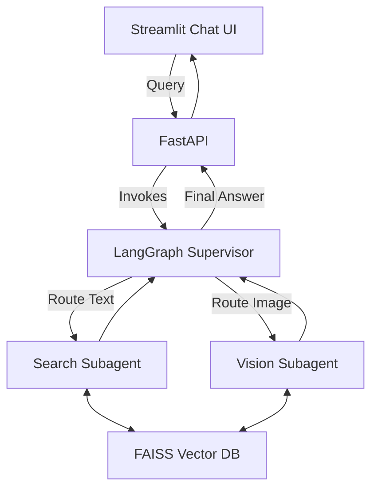
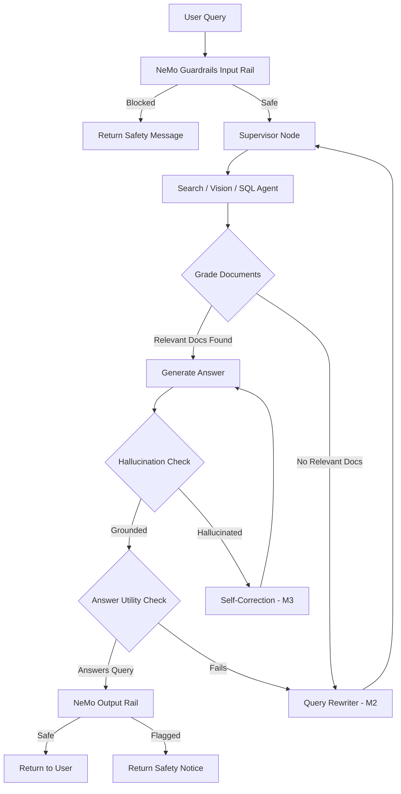
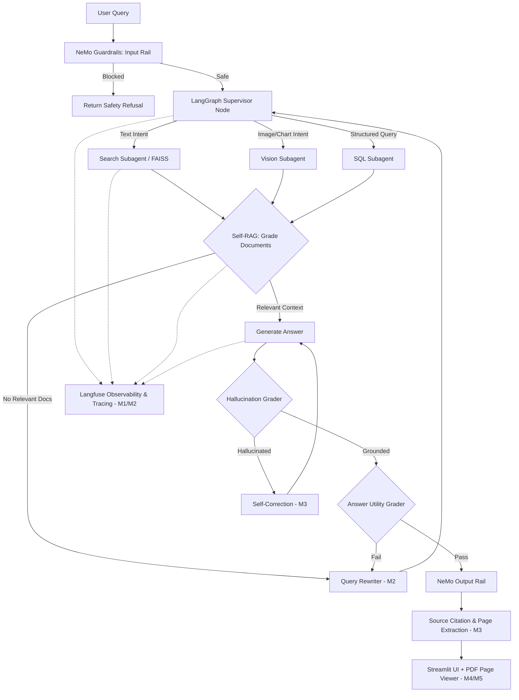

# OmniBrain — Agentic Multi-Modal RAG Orchestrator

> An intelligent, self-correcting multi-agent RAG system that ingests PDF documents, extracts text and visual content, and answers queries using a LangGraph-powered orchestration pipeline with NeMo Guardrails safety controls.

---

## Team Members

| Member | Name | Role |
|---|---|---|
| Member 1 | Kushi | LangGraph State Machine / Self-RAG Logic |
| Member 2 | Chaitanya | Supervisor Agent & Routing / Self-Correction Loop |
| Member 3 | Ranjith | Subagents / NeMo Guardrails |
| Member 4 | Ravi | FastAPI Backend / Streamlit Chat UI |
| Member 5 | Vasu Sree | Integration & Testing / Query Rewrite Agent |

---

## Week 1 — Multi-Modal Ingestion Pipeline

### Objective
Build a system capable of uploading PDF documents, extracting text and images, generating embeddings, storing them in a vector database, and exposing FastAPI endpoints for document upload and querying.

### Member Contributions
| Member | Task | Status |
|---|---|---|
| Member 1 (Kushi) | PDF Parsing & Text Extraction | ✅ Done |
| Member 2 (Chaitanya) | Image Extraction & Vision Pipeline | ✅ Done |
| Member 3 (Ranjith) | Text Embeddings & FAISS Vector DB | ✅ Done |
| Member 4 (Ravi) | FastAPI Backend | ✅ Done |
| Member 5 (Vasu Sree) | Integration & Testing | ✅ Done |

### Week 1 Progress
- ✅ Project Setup
- ✅ PDF Parsing (PyMuPDF)
- ✅ Image Extraction
- ✅ Text Chunking (500-char chunks)
- ✅ Embeddings (`all-MiniLM-L6-v2`)
- ✅ FAISS IndexFlatL2 Vector Database
- ✅ FastAPI Endpoints (`/upload`, `/upload/status`, `/query`)
- ✅ Docker & Docker Compose Setup

---

## Week 2 — Agentic Orchestration & Streamlit UI

### Objective
Wrap the ingestion pipeline in a LangGraph state machine, implement supervisor-based routing to specialized subagents, build a Streamlit Chat UI, and visualize the multi-agent architecture end-to-end.

### Member Contributions
| Member | Task | Status |
|---|---|---|
| Member 1 (Kushi) | LangGraph State Machine | ✅ Done |
| Member 2 (Chaitanya) | Supervisor Agent & Routing Logic | ✅ Done |
| Member 3 (Ranjith) | Search & Vision Subagents | ✅ Done |
| Member 4 (Ravi) | Streamlit Chat UI + Docker Integration | ✅ Done |
| Member 5 (Vasu Sree) | Integration Testing & Process Visualization | ✅ Done |

### Week 2 Progress
- ✅ LangGraph State Machine with `AgentState` TypedDict
- ✅ Supervisor Agent with conditional routing (Search / Vision / SQL)
- ✅ Search Subagent (FAISS semantic retrieval)
- ✅ Vision Subagent (Image metadata retrieval)
- ✅ Streamlit Chat UI with PDF upload polling and thought-process visualization
- ✅ Automated API integration tests (Jupyter Notebook)
- ✅ Mermaid architecture diagram

### System Architecture (Week 2)


---

## Week 3 — Self-RAG, Guardrails & Self-Correction

### Objective
Implement the Self-RAG validation loop, a query rewriting agent, a self-correction mechanism, NeMo Guardrails for safety, and a full integration test suite covering all components.

### Member Contributions
| Member | Task | Status |
|---|---|---|
| Member 1 (Ravi) | Self-RAG Logic (Document Grading, Hallucination Check, Answer Utility) | ✅ Done |
| Member 2 (Vasu Sree) | Query Rewrite Agent | ✅ Done |
| Member 3 (Chaitanya) | Self-Correction Loop Integration | ✅ Done |
| Member 4 (Ranjith) | NeMo Guardrails (Input/Output Safety Rails) | ✅ Done |
| Member 5 (Kushi) | Integration Test Suite (25/25 passing) | ✅ Done |

### Week 3 Progress
- ✅ Self-RAG Graders (`GradeDocuments`, `GradeHallucination`, `GradeAnswer`)
- ✅ Query Rewrite Agent (LLM + heuristic fallback)
- ✅ Self-Correction Loop (LLM-backed fact grounding)
- ✅ NeMo Guardrails (`guardrails/config.yml` + `guardrails/main.co`)
  - Jailbreak detection and blocking
  - Harmful content detection
  - Off-topic query filtering
  - Unsafe output flagging
- ✅ Guardrails integrated into FastAPI `/chat` endpoint
- ✅ 25/25 integration tests passing in 0.083s

### Self-RAG Pipeline (Week 3)


---

## Week 4 — Observability, Tracing, Citations & UI Polish

### Objective
Integrate end-to-end LLM observability and tracing via Langfuse, build pipeline step tracing throughout the Self-RAG LangGraph state machine, implement citation and source attribution in the backend, develop an interactive citation viewer with an inline PDF page renderer, and deliver a polished Streamlit UI with a comprehensive integration test suite.

### Member Contributions
| Member | Task | Status |
|---|---|---|
| Member 1 (Vasu Sree) | Langfuse Observability Integration (Traces, Spans, Generation & Score Logging) | ✅ Done |
| Member 2 (Chaitanya) | RAG Pipeline Step Tracing & LangGraph Node Spans | ✅ Done |
| Member 3 (Ranjith) | Citation & Source Tracing Backend | ✅ Done |
| Member 4 (Ravi) | Citation UI / Inline PDF Page Viewer (PyMuPDF) | ✅ Done |
| Member 5 (Kushi) | UI Polish + Full Integration & Testing Suite (24/24 passing) | ✅ Done |

### Week 4 Progress
- ✅ **Langfuse Observability Integration (Member 1)**:
  - Centralized `LangfuseClient` with trace and child span management
  - LLM generation logging with token tracking and parameter capture
  - Grader score recording (relevance ratio, groundedness, utility)
  - `@traced_node` decorator for automatic node wrapping
  - Graceful fallback to console mode when credentials are absent
- ✅ **RAG Pipeline Step Tracing (Member 2)**:
  - Traced execution across all LangGraph nodes (`supervisor`, `search`, `vision`, `sql`, `grade_documents`, `generate_answer`, `query_rewriter`, `self_correct`)
  - Execution span nesting and latency measurement
  - Propagation of `trace_id` through the `GraphState` state machine
- ✅ **Citation & Source Tracing Backend (Member 3)**:
  - Source chunk mapping with page numbers, document IDs, and similarity scores
  - Document filtering in `SelfRAGAgent`
  - Extended chat schema with confidence scores, iterations, and citation payloads
- ✅ **Citation UI & PDF Page Viewer (Member 4)**:
  - Interactive PDF page viewer using PyMuPDF (fitz) rendering
  - Base64 inline page streaming with zoom controls
  - Citation cards with page badges and relevance indicators
- ✅ **UI Polish & Comprehensive Integration Testing (Member 5)**:
  - Polished Cyber-Indigo Streamlit interface with suggested prompts and live backend health indicators
  - Dual-mode execution engine (FastAPI `/chat` backend with LangGraph local fallback)
  - Interactive Citation jump buttons (synchronizing the PDF viewer directly to cited pages)
  - Observability & diagnostics dashboard tab with live trace history
  - Complete 24-test integration suite covering all 5 members' modules (`tests/test_week4_integration.py` - 24/24 passing in 0.22s)

### System Architecture (Week 4)


---

## Project Structure

```text
omniproject/
├── backend/                     # FastAPI backend server
│   └── app/
│       ├── api/
│       │   ├── chat.py          # Chat endpoint with NeMo Guardrails & tracing
│       │   ├── documents.py     # Document listing and deletion
│       │   ├── health.py        # Health-check endpoints
│       │   └── upload.py        # PDF document upload API
│       ├── schemas/
│       │   ├── chat.py          # Chat schemas with citations & confidence
│       │   ├── document.py      # Document metadata schemas
│       │   └── upload.py        # Upload response schemas
│       ├── services/            # Retrieval, generation & evaluators
│       └── utils/
│           └── tracing.py       # Tracing context managers
├── graph_workflow/              # LangGraph state machine & Self-RAG
│   ├── state.py                 # GraphState TypedDict (with trace_id)
│   ├── langgraph_workflow.py    # Full compiled state graph with Langfuse spans
│   ├── self_rag_graders.py      # Self-RAG grading schemas
│   ├── query_rewriter.py        # Query rewrite agent
│   ├── self_correction.py       # Self-correction loop
│   └── guardrails_wrapper.py    # NeMo Guardrails wrapper
├── guardrails/                  # NeMo Guardrails configuration
│   ├── config.yml
│   └── main.co
├── observability/               # LLM Observability
│   └── langfuse_client.py       # Week 4 - M1: Langfuse tracing client
├── tests/
│   ├── test_week3_integration.py  # Week 3 integration tests (24/24 passing)
│   └── test_week4_integration.py  # Week 4 full integration suite (24/24 passing)
├── ui/
│   └── app.py                   # Week 4 - M4/M5: Polished Streamlit Chat & PDF Viewer
├── notebooks/                   # Jupyter analysis & pipeline notebooks
├── docker-compose.yml
├── Dockerfile.ui
├── requirements.txt
└── README.md
```

---

## Technologies

| Layer | Technology |
|---|---|
| Language | Python 3.11+ |
| Backend | FastAPI + Uvicorn |
| Agent Orchestration | LangGraph |
| Observability & Tracing | Langfuse |
| LLM Integration | LangChain + OpenAI |
| PDF Processing | PyMuPDF (fitz) |
| Embeddings | `sentence-transformers/all-MiniLM-L6-v2` |
| Vector Database | FAISS (IndexFlatL2) |
| Safety Guardrails | NeMo Guardrails (NVIDIA) |
| Frontend | Streamlit |
| Containerization | Docker + Docker Compose |

---

## Quick Start

```bash
# Clone the repository
git clone https://github.com/kushim2005/omniproject.git
cd omniproject

# Install dependencies
pip install -r requirements.txt

# Run the backend
uvicorn backend.app.main:app --reload --port 8000

# Run the Streamlit UI (in a separate terminal)
streamlit run ui/app.py

# Or run everything with Docker
docker-compose up --build -d
```

## Running Integration Tests

```bash
# Run Week 4 Comprehensive Integration Test Suite
python tests/test_week4_integration.py
# Expected: Ran 24 tests in ~0.22s — PASSED [OK]

# Run Week 3 Integration Tests
python tests/test_week3_integration.py
# Expected: Ran 24 tests in ~0.08s — PASSED [OK]
```
