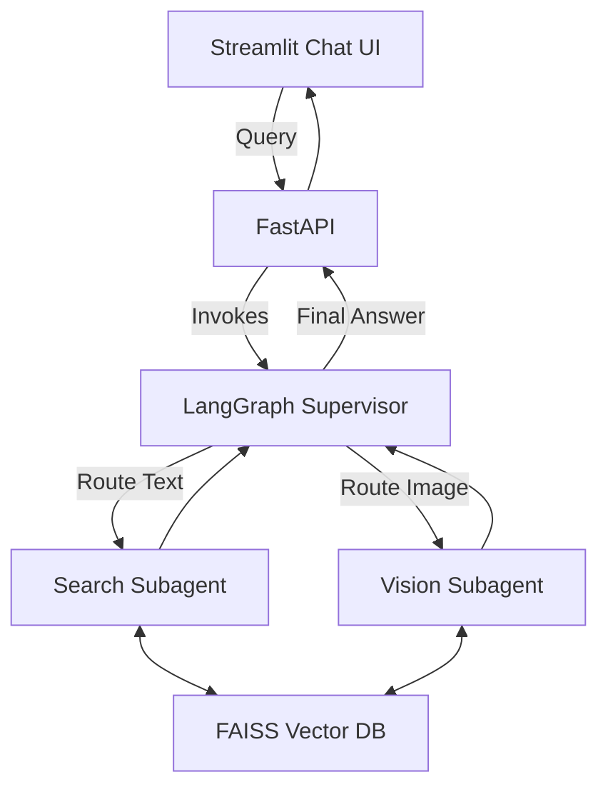
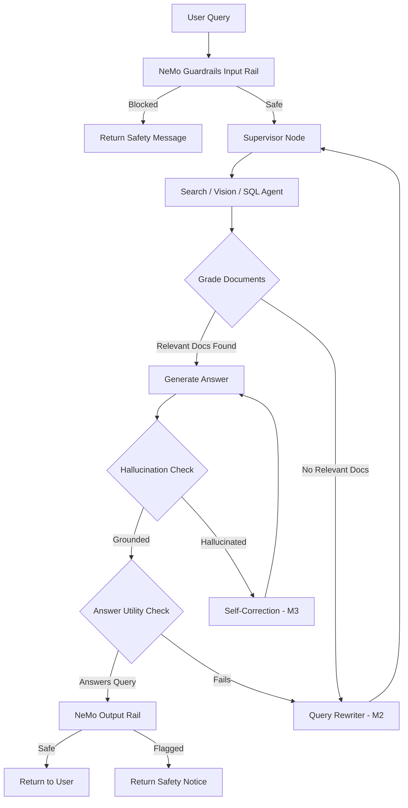

# OmniBrain — Agentic Multi-Modal RAG Orchestrator

> An intelligent, self-correcting multi-agent RAG system that ingests PDF documents, extracts text and visual content, and answers queries using a LangGraph-powered orchestration pipeline with NeMo Guardrails safety controls.

---

## Team Members

| Member | Name | Role |
|---|---|---|
| Member 1 | Kushi | LangGraph State Machine / Self-RAG Logic |
| Member 2 | Chaitanya | Supervisor Agent & Routing / Self-Correction Loop |
| Member 3 | Ranjith | Subagents / NeMo Guardrails |
| Member 4 | Ravi | FastAPI Backend / Streamlit Chat UI |
| Member 5 | Vasu Sree | Integration & Testing / Query Rewrite Agent |

---

## Week 1 — Multi-Modal Ingestion Pipeline

### Objective
Build a system capable of uploading PDF documents, extracting text and images, generating embeddings, storing them in a vector database, and exposing FastAPI endpoints for document upload and querying.

### Member Contributions
| Member | Task | Status |
|---|---|---|
| Member 1 (Kushi) | PDF Parsing & Text Extraction | ✅ Done |
| Member 2 (Chaitanya) | Image Extraction & Vision Pipeline | ✅ Done |
| Member 3 (Ranjith) | Text Embeddings & FAISS Vector DB | ✅ Done |
| Member 4 (Ravi) | FastAPI Backend | ✅ Done |
| Member 5 (Vasu Sree) | Integration & Testing | ✅ Done |

### Week 1 Progress
- ✅ Project Setup
- ✅ PDF Parsing (PyMuPDF)
- ✅ Image Extraction
- ✅ Text Chunking (500-char chunks)
- ✅ Embeddings (`all-MiniLM-L6-v2`)
- ✅ FAISS IndexFlatL2 Vector Database
- ✅ FastAPI Endpoints (`/upload`, `/upload/status`, `/query`)
- ✅ Docker & Docker Compose Setup

---

## Week 2 — Agentic Orchestration & Streamlit UI

### Objective
Wrap the ingestion pipeline in a LangGraph state machine, implement supervisor-based routing to specialized subagents, build a Streamlit Chat UI, and visualize the multi-agent architecture end-to-end.

### Member Contributions
| Member | Task | Status |
|---|---|---|
| Member 1 (Kushi) | LangGraph State Machine | ✅ Done |
| Member 2 (Chaitanya) | Supervisor Agent & Routing Logic | ✅ Done |
| Member 3 (Ranjith) | Search & Vision Subagents | ✅ Done |
| Member 4 (Ravi) | Streamlit Chat UI + Docker Integration | ✅ Done |
| Member 5 (Vasu Sree) | Integration Testing & Process Visualization | ✅ Done |

### Week 2 Progress
- ✅ LangGraph State Machine with `AgentState` TypedDict
- ✅ Supervisor Agent with conditional routing (Search / Vision / SQL)
- ✅ Search Subagent (FAISS semantic retrieval)
- ✅ Vision Subagent (Image metadata retrieval)
- ✅ Streamlit Chat UI with PDF upload polling and thought-process visualization
- ✅ Automated API integration tests (Jupyter Notebook)
- ✅ Mermaid architecture diagram

### System Architecture (Week 2)


---

## Week 3 — Self-RAG, Guardrails & Self-Correction

### Objective
Implement the Self-RAG validation loop, a query rewriting agent, a self-correction mechanism, NeMo Guardrails for safety, and a full integration test suite covering all components.

### Member Contributions
| Member | Task | Status |
|---|---|---|
| Member 1 (Ravi) | Self-RAG Logic (Document Grading, Hallucination Check, Answer Utility) | ✅ Done |
| Member 2 (Vasu Sree) | Query Rewrite Agent | ✅ Done |
| Member 3 (Chaitanya) | Self-Correction Loop Integration | ✅ Done |
| Member 4 (Ranjith) | NeMo Guardrails (Input/Output Safety Rails) | ✅ Done |
| Member 5 (Kushi) | Integration Test Suite (25/25 passing) | ✅ Done |

### Week 3 Progress
- ✅ Self-RAG Graders (`GradeDocuments`, `GradeHallucination`, `GradeAnswer`)
- ✅ Query Rewrite Agent (LLM + heuristic fallback)
- ✅ Self-Correction Loop (LLM-backed fact grounding)
- ✅ NeMo Guardrails (`guardrails/config.yml` + `guardrails/main.co`)
  - Jailbreak detection and blocking
  - Harmful content detection
  - Off-topic query filtering
  - Unsafe output flagging
- ✅ Guardrails integrated into FastAPI `/chat` endpoint
- ✅ 25/25 integration tests passing in 0.083s

### Self-RAG Pipeline (Week 3)


---

## Project Structure

```text
omniproject/
├── backend/                     # FastAPI backend server
│   └── app/
│       ├── api/
│       │   └── chat.py          # Chat endpoint with NeMo Guardrails
│       └── schemas/
├── graph_workflow/              # LangGraph state machine
│   ├── state.py                 # GraphState TypedDict
│   ├── langgraph_workflow.py    # Full compiled state graph
│   ├── self_rag_graders.py      # Week 3 - M1: Self-RAG grading schemas
│   ├── query_rewriter.py        # Week 3 - M2: Query rewrite agent
│   ├── self_correction.py       # Week 3 - M3: Self-correction loop
│   └── guardrails_wrapper.py    # Week 3 - M4: NeMo Guardrails wrapper
├── guardrails/                  # NeMo Guardrails config
│   ├── config.yml
│   └── main.co
├── tests/
│   └── test_week3_integration.py  # 25/25 passing tests
├── ui/
│   └── app.py                   # Streamlit Chat UI
├── notebooks/
│   └── Integration_and_Visualization.ipynb
├── docker-compose.yml
├── Dockerfile.ui
├── requirements.txt
└── README.md
```

---

## Technologies

| Layer | Technology |
|---|---|
| Language | Python 3.11+ |
| Backend | FastAPI + Uvicorn |
| Agent Orchestration | LangGraph |
| LLM Integration | LangChain + OpenAI |
| PDF Processing | PyMuPDF (fitz) |
| Embeddings | `sentence-transformers/all-MiniLM-L6-v2` |
| Vector Database | FAISS (IndexFlatL2) |
| Safety Guardrails | NeMo Guardrails (NVIDIA) |
| Frontend | Streamlit |
| Containerization | Docker + Docker Compose |

---

## Quick Start

```bash
# Clone the repository
git clone https://github.com/kushim2005/omniproject.git
cd omniproject

# Install dependencies
pip install -r requirements.txt

# Run the backend
uvicorn backend.app.main:app --reload --port 8000

# Run the Streamlit UI (in a separate terminal)
streamlit run ui/app.py

# Or run everything with Docker
docker-compose up --build -d
```

## Running Integration Tests (Week 3)

```bash
python tests/test_week3_integration.py
# Expected: Ran 25 tests in ~0.08s — OK
```
