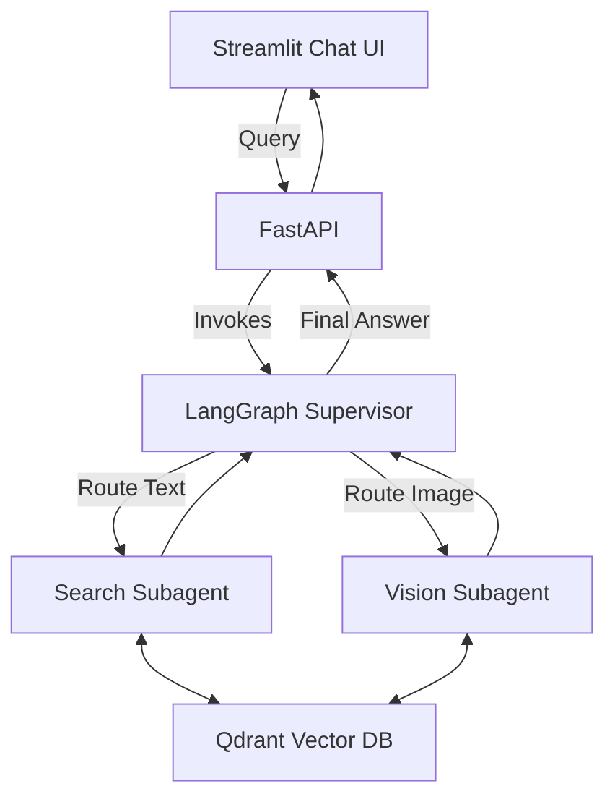

# OmniBrain - Agentic Multi-Modal RAG Orchestrator

## Week 1 - Multi-Modal Ingestion Pipeline

### Objective
Build a system capable of:
- Uploading PDF documents
- Extracting text and images
- Generating text and image embeddings
- Storing embeddings in Qdrant
- Providing FastAPI endpoints for document upload and querying

## Team Members
- Member 1 – PDF Parsing & Text Extraction
- Member 2 – Image Extraction & Vision Pipeline
- Member 3 – Text Embeddings & Qdrant
- Member 4 – FastAPI Backend
- Member 5 – Integration & Testing

## Project Structure

```text
backend/
frontend/
data/
images/
vector_db/
README.md
requirements.txt
```

## Technologies
- Python
- FastAPI
- PyMuPDF
- LangChain
- Sentence Transformers
- OpenCLIP
- Qdrant
- Streamlit (Week 2)

## Week 1 Progress
-  Project Setup
-  PDF Parsing
-  Image Extraction
-  Text Chunking
-  Embeddings
-  FastAPI APIs
-  Qdrant Integration

## Week 2 Progress
-  LangGraph State Machine
-  Supervisor Agent & Routing Logic
-  Subagents (Search & Vision)
-  Streamlit Chat UI Integration
-  Integration & Testing Visualization (Member 5)

## 📊 System Architecture (Week 2)

